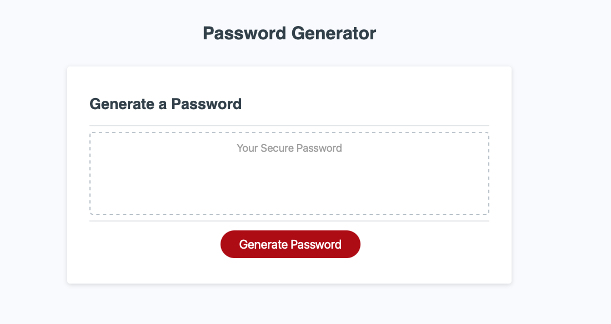
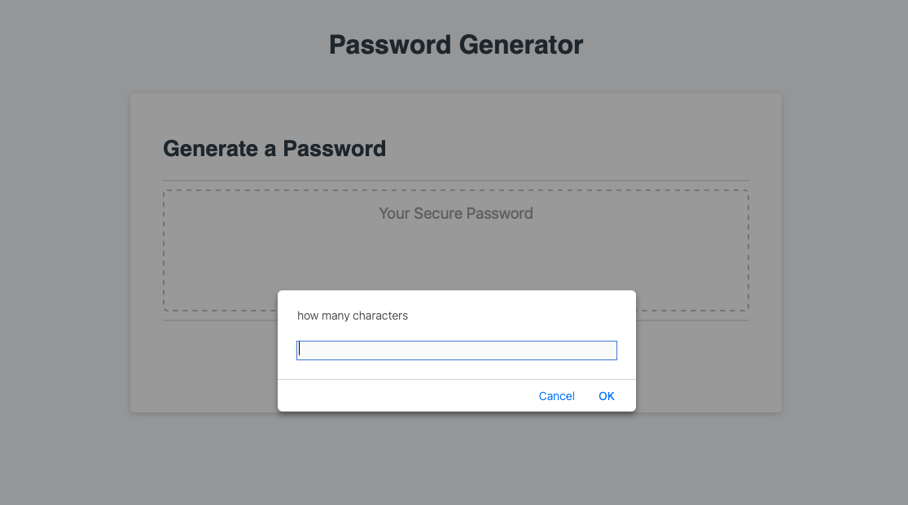
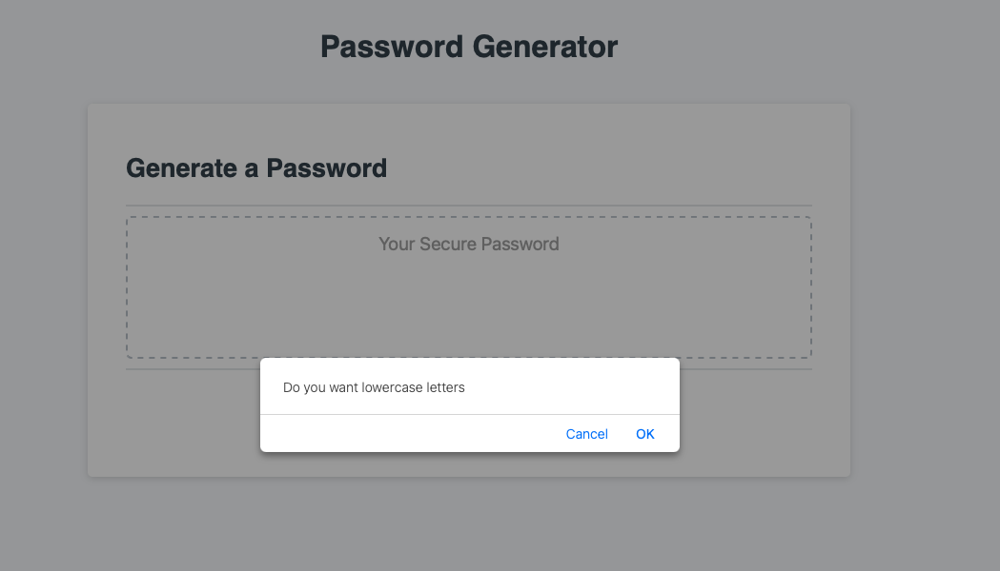
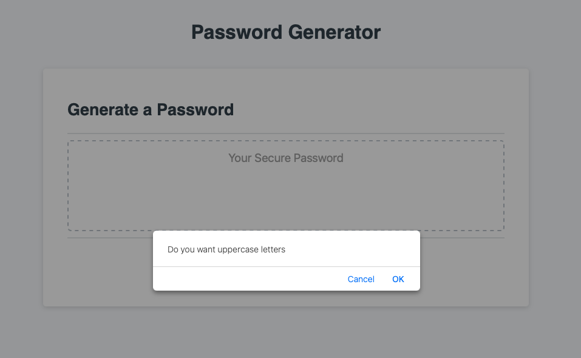
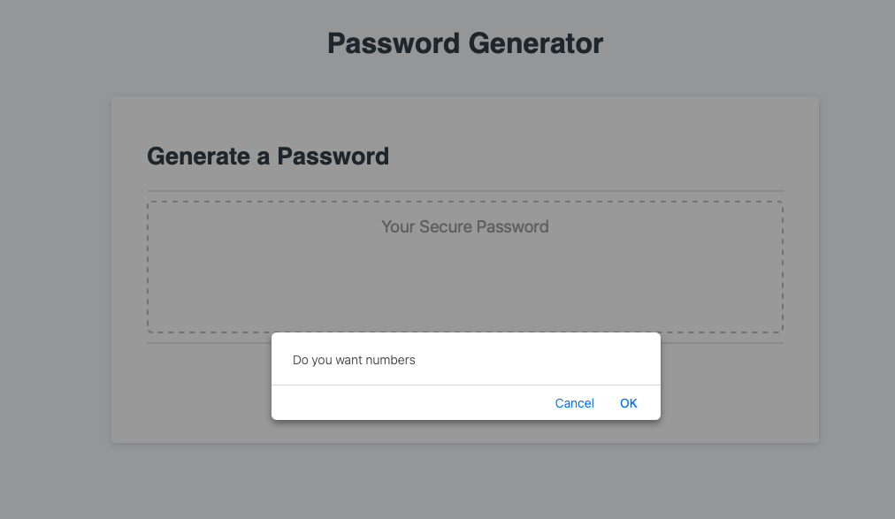
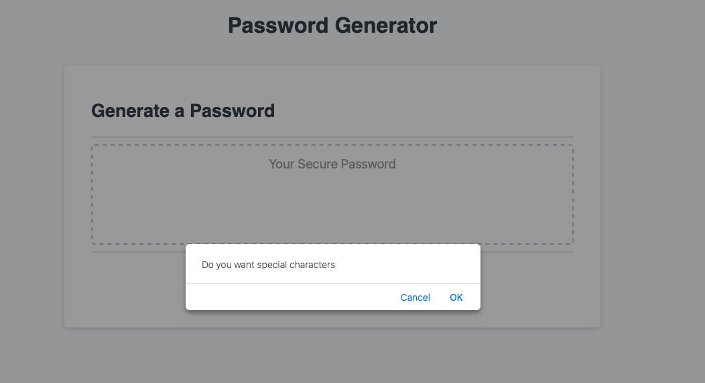
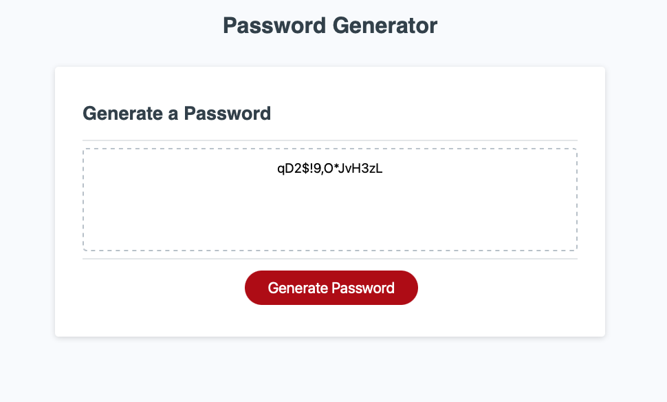

# Password Generator

This web application is used to generate a password with the criterias that are defined by the user

## Table of Contents

- [Installation](#installation) 
 
- [Usage](#usage) 
  

- [Features](#features) 
- [Contributing](#contributing)
- [License](#license)
- [Credits](#credits)
- [Contact](#contact)

## Installation
 - N/A

## Usage

- click the link - https://kenneilsmith.github.io/password_generator_mod_3/

## Features

- A user select the length of the desired password 
- A user and select the options of adding uppercase, lowercase, numbers and/or special characters 
- User will be given a password that matches the criteria \

## License

This project is licensed under the MIT License.

## Credits
   -    TanUv90 - GitHub Readme Images Tutorial  - https://www.youtube.com/watch?v=hHbWF1Bvgf4

## Contact

Damian Smith - damiansmith61@gmail.com \
Project Link: https://github.com/kenneilsmith/password_generator_mod_3
